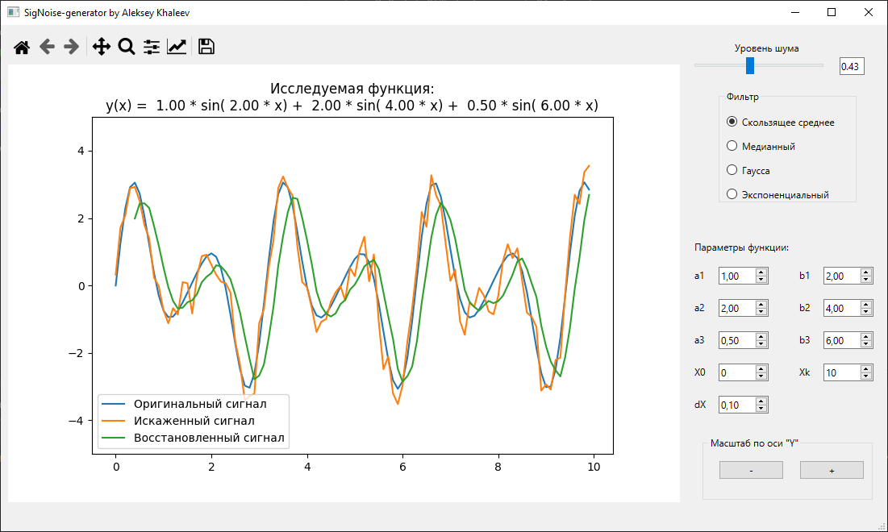
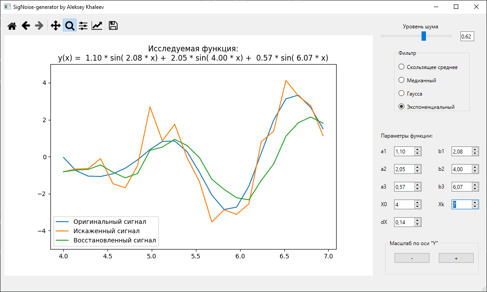

# SigNoise-generator

## Обзор

Этот проект представляет собой приложение на Python, созданное с использованием PySide6 и Matplotlib. Оно позволяет пользователям строить графики математических функций, добавлять к ним шум (с регулируемой интенсивностью) и применять различные фильтры к зашумленным данным. Приложение также включает навигацию по масштабу и интерактивное изменение параметров исходной функции.

## Особенности

- **Построение математических функций**: Визуализация математических функций на графике.
- **Добавление шума**: Введение шума в функцию с регулируемой интенсивностью.
- **Применение фильтров**:
  - Скользящее среднее
  - Медианный фильтр
  - Экспоненциальный фильтр
  - Фильтр Гаусса
- **Навигация по масштабу**: Навигация и увеличение определенных частей графика.
- **Интерактивное изменение параметров**: Изменение параметров и множителей исходной функции в реальном времени.

## Требования

- Python 3.x
- PySide6
- Matplotlib
- NumPy

## Установка

1. **Клонируйте репозиторий**:
    ```bash
    git clone https://github.com/AlekseyKhaleev/SigNoise-generator
    cd SigNoise-generator
    ```

2. **Установите Poetry** (если еще не установлен):
    ```bash
    pip install poetry
    ```

3. **Установите зависимости с помощью Poetry**:
    ```bash
    poetry install
    ```

4. **Запустите приложение**:
    ```bash
    poetry run python main.py
    ```

## Использование

1. **Построение функций**: Используйте предоставленный интерфейс для ввода желаемой математической функции.
2. **Добавление шума**: Отрегулируйте ползунок интенсивности шума, чтобы добавить шум к функции.
3. **Применение фильтров**: Выберите и примените различные фильтры к зашумленной функции, чтобы увидеть эффект.
4. **Навигация по масштабу**: Используйте инструменты увеличения для исследования различных частей графика.
5. **Изменение параметров**: Интерактивно изменяйте параметры и множители исходной функции с помощью ползунков.

## Скриншоты


*Основной интерфейс с графиком функции, управлением шумом и опциями фильтров.*


*Применение различных фильтров к зашумленной функции.*

## Лицензия

Этот проект лицензирован под лицензией MIT. См. файл [LICENSE](LICENSE) для подробностей.

## Благодарности

- [PySide6](https://www.qt.io/qt-for-python)
- [Matplotlib](https://matplotlib.org/)
- [NumPy](https://numpy.org/)

